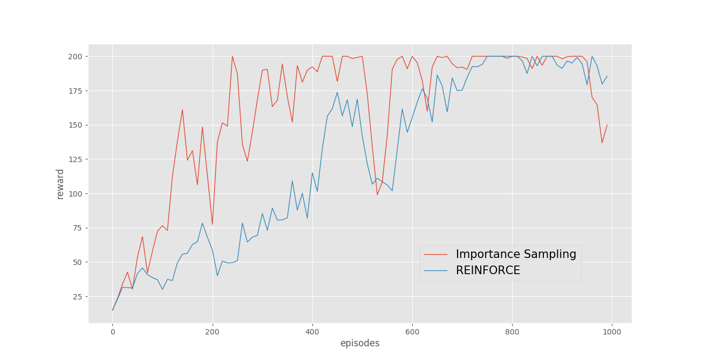

# policy-gradient-importance-sampling

Importance sampling is technique to estimate expectation of function under distribution p(x) with samples drawn from another distribution q(x). In policy gradient, this technique makes agent to use off-policy samples (samples T = (s1,a1,s2,a2,....) drawn from old policy) to update current policy. Thus, importance sampled policy gradient can reuse previous samples for training, ensures faster convergence.

## Requirements

- Python
- [numpy](https://www.numpy.org/)
- [pytorch](https://pytorch.org/)
- [gym](https://github.com/openai/gym)
- [matplotlib](https://matplotlib.org/users/installing.html)

## Usage

   $ python main.py (--reinforce to run REINFORCE example)

## Reference

[JamesChuangg's REINFORCE implementation](https://github.com/JamesChuanggg/pytorch-REINFORCE)
